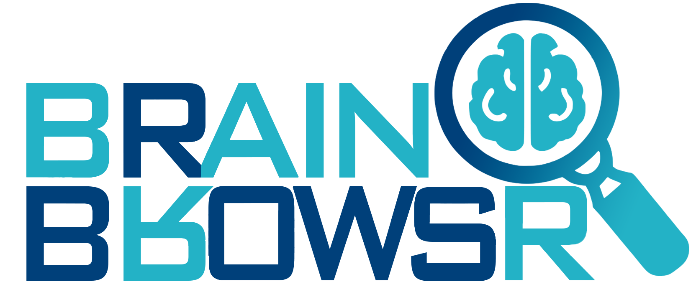
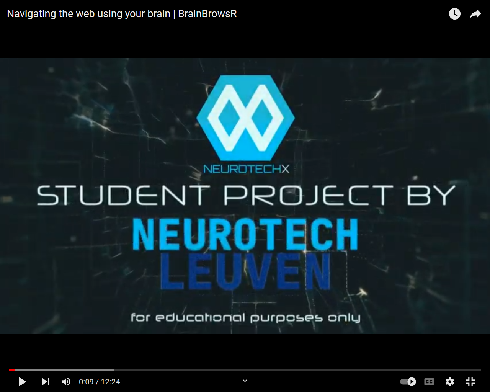
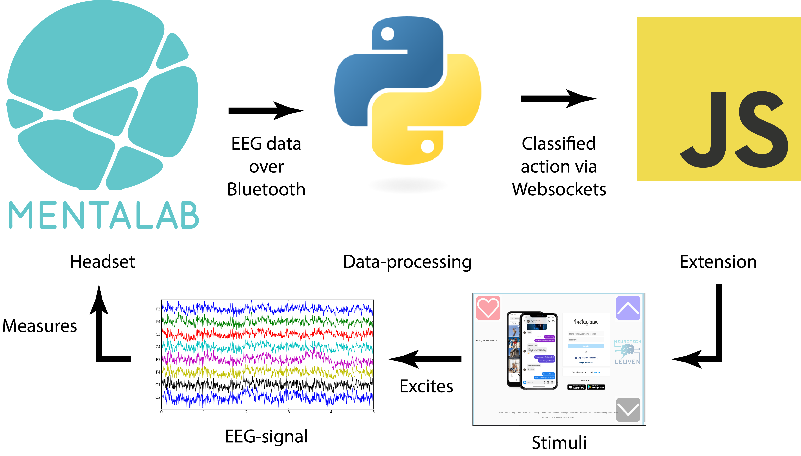
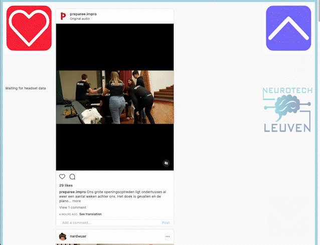
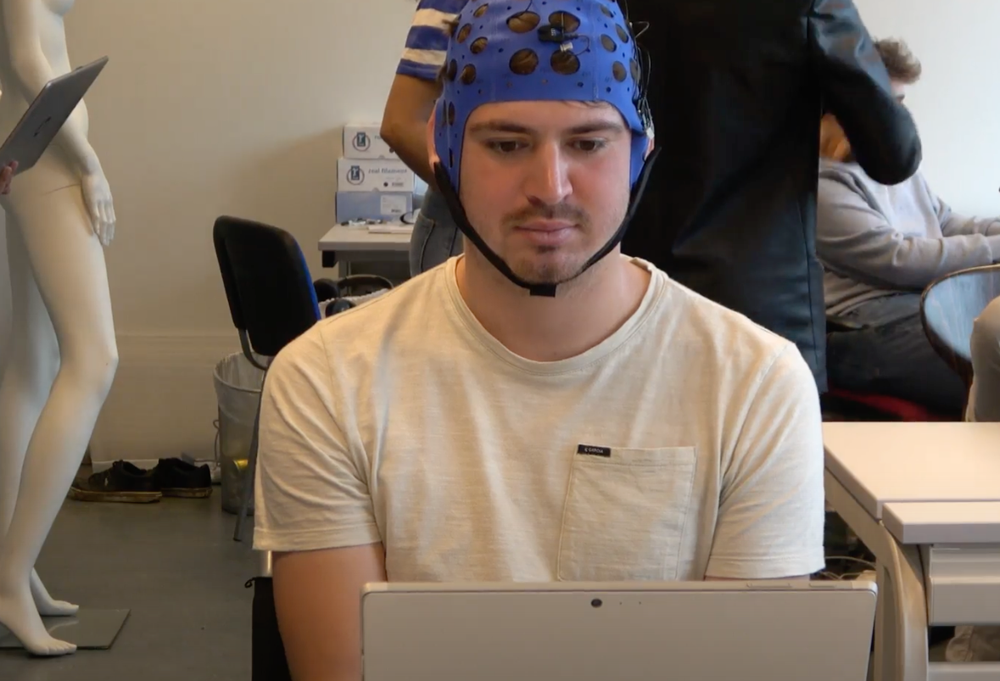

# BrainBrowsR

This GitHub repo is the project code of NeuroTechLeuven's BrainBrowsR!
BrainBrowsR is a software stack that allows a user to control the browser through SSVEP. We want to unlock social media for people with extreme paralysis, ALS or locked-in syndrome.

To achieve this, we built a web extension that inserts stimuli into the web page. These flickering elements generate a specific electrical signal in the brain, which we can measure with a commercially available electroencephalogram (EEG) headset.



## Project Video

[](https://youtu.be/eefQyHi1Bd8)

## Project Overview

This document is a very brief overview of our project. For people interested in more details, check out [our documentation](docs/README.md).

### Top-down overview

To represent BrainBrowsR we can use the following diagram:



#### Stimuli



The data starts from the stimuli. They are inserted in our extension as HTML elements and animated using CSS into the web page. This approach makes it extremely simple for developers to change the frequency, icon, color and other properties. Moreover, it can be extended to other websites as well. When the user focuses on a specific element, the brain reacts accordingly. More details about the stimuli can be found in [our documentation](docs/extension/stimuli.md).

#### Headset



The stimuli excite the brain, so the electroencephalogram (EEG) signals at the visual cortex will have the same frequency. In order to measure this potential, we need an EEG headset. We tested out various dry electrode headsets but decided on the headset produced by [Mentalab](https://mentalab.com). It does not require gel, is easy and quick to put on, and is comfortable to wear. More details can be found [here](docs/headset.md).

#### [Data processing](docs/data_processing.md)

The signals obtained from the headset are perturbed by noise due to various effects, such as powerline noise, movement artefacts and other brain activity. This noise is filtered out by preprocessing. [More details](docs/data_processing/preprocessing.md) on which filters were used and why.

After the data has been cleaned, we can classify it. Here the most dominant frequency in the signal is found using techniques from signal processing. This methodology can be found [here](docs/data_processing/classification.md).

#### Websockets

The label obtained by classification is sent over to the extension through WebSockets, a technology similar to HTTP, where multiple messages can be sent in both directions. The WebSockets layer connects the extension with data processing. To read more about WebSockets, see [here](docs/websockets.md).

#### Extension

The data processing part will tell the extension to perform a specific action. For this, we need a parsing function and a processing function. The parsing function will find elements on the page, while the processing function will use these elements to act. In BrainBrowsr, we have implemented navigating between posts and liking posts. As the following action, we can add new actions in Instagram, such as commenting and implementing it for other websites. The methodology to do this can be found [here](docs/extension.md).

### NeuroTech Leuven

[NeuroTech Leuven](https://www.ntxl.org) is an organization based in Leuven, where students work together on projects and events are organised to promote neurotechnology in Belgium.

### The team


The BrainBrowsR team consists of the following people, mentioned alphabetically:

- Rochelle Aubry
- Samuel Berton
- Yitong Li
- Jone Liekens
- Rien Sonck
- Arne Staes
- Wout Van Droogenbroeck
- Nils Van Rompaey
- Joppe Van Rumst
- Anthony Vorias

## Repo structure

The [docs](./docs/) folder contains the entire explanation of how the project works. This documentation is written primarily with other developers and researchers in mind.

The [Icons](./icons/) folder contains the PNG used for the stimuli in BrainBrowsR.

The [src](./src/) folder contains the extension code. This code is organised into 5 folders:

1. [css](./src/CSS/), containing the CSS files needed in the extension,
2. [data_processing](src/data_processing/), which contains all methods used to perform the data_processing pipeline,
3. [helpers](./src/helpers/), files that are used by the content_script.js to perform certain actions,
4. [html](src/HTML/), the HTML code needed by the extension,
5. [stimuli](src/stimuli/), some helper functions related to stimuli.

The [server.py](server.py) is the back-end code that connects the headset and does the data processing.

The [manifest.json](manifest.JSON) is the configuration file for the extension. To learn more about this, you can read this [page](https://developer.mozilla.org/en-US/docs/Mozilla/Add-ons/WebExtensions/manifest.json) by Mozilla.

## Installation & Usage

The project has two components: a data processing part connected with the EEG headset, coded in Python, and a software part written in JavaScript.

To run the Python code, we recommend creating a virtual environment and then installing the dependencies in it using the following:

```bash
pip install -r requirements.txt
```

To create a virtual environment, use [this document](docs/virtual_environments.md) in our documentation.

This command will install all the necessary packages and their dependencies. Please check that the Python version is higher than 3.5. In the terminal, now run the local data-processing server using

```bash
python server.py
```

This command will connect with the headset and start a WebSocket server.

To set up the headset and connect with it, read our [headset guide](docs/headset.md).

Once the server has been initiated, the extension can be started. Currently, we are looking to make it possible to install the extension from Mozilla. Until then, either web-ext or developer tools can be used to run it.

The instructions to install web-ext are on [this webpage](https://extensionworkshop.com/documentation/develop/getting-started-with-web-ext/). To run, do `web-ext run`. Going to Instagram and login-in will connect to the WebSocket server and allow the usage of the extension.

The other option is temporarily installing it, using [these instructions](https://extensionworkshop.com/documentation/develop/temporary-installation-in-firefox/) and proceeding similarly as with web-ext.

## Limitation and future plans

-A lot still has to happen before BrainBrowsR reaches its end-users. We interviewed Steven Laureys, a Neurologist who worked with LIS patients, and Ujwal Chaudhary, founder of ALS voice. They underlined our application's potential positive impact on their patients and supported our initiative. They indicated a considerable gap between getting our application to work on healthy patients versus our intended patient group. Regarding the limited time and the ethical and regulatory challenges of working with actual patients, this still needs to be done in the future with the help of the two specialists. The interview with questions and answers of the specialist can be found [here](https://github.com/NeuroTech-Leuven/Project-22/blob/main/docs/Human%20practices.md).

- There is a limit on the number of interactive elements shown on one screen. Better visualization of these stimuli and more precise measuring equipment could be beneficial.

- More measures must be taken into account for errors in our software. It can be very frustrating for the user when something does not work correctly. Therefore we would perform customer service as quickly as possible and implement more mechanisms for a smoother user experience for both the user and their caretakers.

- Our software can readily implement a keyboard that works on different classifying algorithms, such as the ones made by other NeuroTechX teams. Doing so and testing which works best would open a lot of communication opportunites for our end-users.

- We are working on BrainBrowsR 2.0, which is now in alpha. It contains several features, such as: Automatic frequency generation; based on harmonics of the refreshrate, The ability to transform any HTML element into a stimulus by merely typing it's class in a list and eyetracking integration.

## Further development

If you wish to use this repo as a basis for your project, we recommend installing web-ext by Mozilla. This tool makes it easier to develop web extensions.
