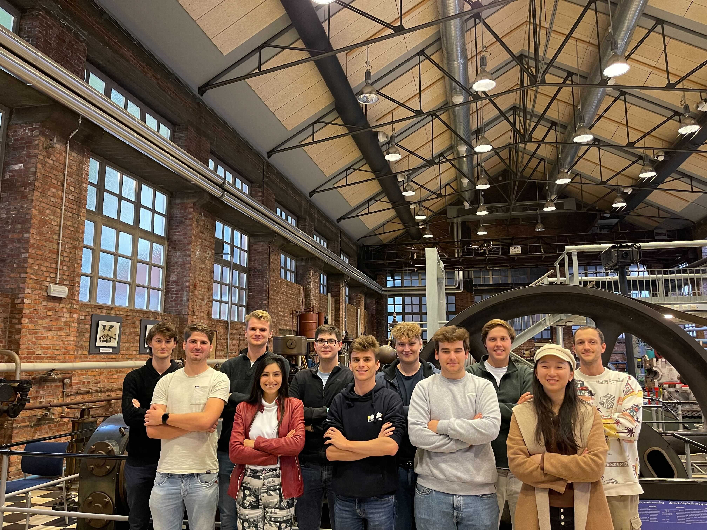

# BrainBrowsR

This is the project code of NeuroTechLeuven's BrainBrowsR!
BrainBrowsR is a software stack that allows a user to control the browser through SSVEP. We want to unlock the social media for people with extreme paralysis, ALS or locked-in syndrome.

To achieve this, we build a web-extension that inserts stimuli into the web-page. Looking at these flickering elements generates a specific electrical signal in the brain, which we can measure commercially available neurotechnology.


## Project Overview

This is a very brief overview of our project. For people interested in more details, check out [our documentation](docs/README.md).

### Our technology stack

The technology behind BrainBrowsR consists of three parts, as shown on the diagram below.


#### Headset

The headset is a commercially available headset produced by [Mentalab](https://mentalab.com). 

### NeuroTech Leuven

[NeuroTech Leuven](ntxl.org) is an organization based in Leuven, where students work together on projects and events are organised to promote neurotechnology in Belgium.

### The team



The BrainBrowsR team consists of the following people, mentioned alphabetically:

- Rochelle Aubry
- Samuel Berton
- Yitong Li
- Jone Liekens
- Rien Sonck
- Arne Staes
- Wout Van Droogenbroeck
- Nils Van Rompaey
- Joppe Van Rumst
- Anthony Vorias

## Repo structure

The [docs](./docs/) folder contains the entire explanation on how the project works. This documentation is written primarily with other developers and researchers in mind.

The [icons](./icons/) folder contains the PNG that are use for the stimuli in BrainBrowsR.

The [src](./src/) folder contains the extension code. This code is organised in 5 folders:

1. [css](./src/css/), containing the css files needed in the extension,
2. [data_processing](src/data_processing/), which contains all methods used to perform the data_processing pipeline,
3. [helpers](./src/helpers/), files that are used by the content_script.js to perform certain actions,
4. [html](src/html/), the html code needed by the extension,
5. [stimuli](src/stimuli/), some helper functions related to stimuli.

The [server.py](server.py) is the back-end code that connects the headset and does the data-processing.

The [manifest.json](manifest.json) is the configuraton file for the extension. To learn more about this, you can read this [page](https://developer.mozilla.org/en-US/docs/Mozilla/Add-ons/WebExtensions/manifest.json) by Mozilla.

## Installation & Usage

There are two components in the project, a data-processing part that connects with the EEG-headset, coded in Python, and the software part written in JavaScript.

To run the Python code, we recommend creating a virtual environment and then installing the dependencies in it, using:

```bash
pip install -r requirements.txt
```

To create a virtual environment, you can use [this document](docs/virtual_environments.md) in our documentation.

This will install all the necessary packages and their dependencies. Please check that your Python version is higher than 3.5. In the terminal, now run the local data-processing server using

```bash
python server.py
```

This will first connect with the headset and then start a websocket server.

To set-up the headset and connect with it, read our [headset guide](docs/headset.md).

Once the server has initiated, you can start using the extension. At the moment, we are looking to make it possible to install the extension from Mozilla. Until then, you can use either web-ext or developer tools to run it.

The instructions to install web-ext are found on [this webpage](https://extensionworkshop.com/documentation/develop/getting-started-with-web-ext/) by Mozilla. To run, simply do `web-ext run`. Going to instagram and login in, will connect you to websocket server and allow the usage of the extension.

The other option is temporarily installing it, using [these instructions](https://extensionworkshop.com/documentation/develop/temporary-installation-in-firefox/) and proceeding similar as with web-ext.

## Limitation and future plans

There is still a lot that has to happen before BrainBrowsR reaches its end-users. We interviewed Steven Laureys, Neurologist who is specialzed in working with LIS patients, and Ujwal Chaudhary, founder of ALS voice. They both underlined the potential positive impact our application could have on their patients and support our initiative. They indicated that there is a huge gap between getting our application work on healthy patients versus our intended patient group. Regarding the limited time and the ethical and regulatory challenges of working with real patients, this still needs to be done in the future with the help of the two specialists. 

Secondly, there is a limit on the number of interactive elements that can be shown on one screen. Better visualization of these stimuli and more precise measuring equipment could be beneficial.

Thirdly, more measures have to be taken into account for errors in our software. It can be very frustrating for the user when something does not work correctly, and while our service to help would be as swift as possible in that case, more mechanisms can be implemented for a smoother user experience for both the user and the user’s caretakers.

Finally, a keyboard that works on different classifying algorithms, maybe the ones made by other NeuroTechX teams, can be readily implemented in our software. Doing so, and testing which works best, would make the user experience smoother.

## Further development

If you wish to use this repo as a basis for your project, we recommend you install web-ext by Mozilla. This tool makes it a picnic to develop webextensions.
