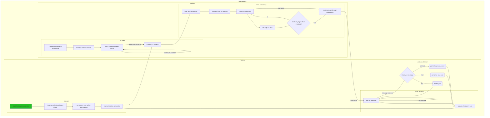

# Documentation

[Return to the mainpage](../README.md)

This is the developer documentation for the BrainBrowsR project by NeuroTech Leuven. The project consists of two main parts, a back-end and and a front-end. These are then connected through [websockets](websockets.md). The global structure that connects everything can be found in the following diagram.

## Back-end

The back-end of BrainBrowR consists of two parts, the websockets server and the data-processing pipeline. The backend is written in Python is invisible to the user of the application. It collects the data from the headset, applies data-processing to it and sends the result to the extension through websockets. To learn more about websockets, go to the documentation in [this document](websockets.md). To learn more about the data-processing pipeline, go to the documentation [here](data_processing.md).

## Front-end

The front-end is the extension. The front-end is written in JavaScript and with Firefox in mind as the browser. Firefox has created some useful tools to make development of the extension easier. However it should be easy to extend the extension to Chromium base browsers. To learn more about the extension, see [here](extension.md)

The extension does three main things, first it inserts the stimuli in the webpage, the methodology for this is written [here](extension/stimuli.md). These stimuli will excite the brain so that the dataprocessing pipeline will detect that the user is looking at a certain stimulus. The extension will then respond appropriately by parsing the right post, described [here](extension/parsing.md) and then [processing this](extension/processing_posts.md).

[Return to the mainpage](../README.md)
