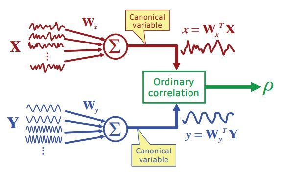

# Canonical Correlation Analysis

Written by: Joppe Van Rumst, Nils Van Rompaey

## Goal

Canonical correlation analysis is still a state-of-the-art classification method for SSVEP. The goal of the method is to find the optimal linear transformation such that the correlation between 2 matrices is maximized.

The method was first applied by the [paper](https://ieeexplore.ieee.org/document/4203016) from Lin et al. where they show it outperforms the at that time best methods for SSVEP classification, such as power spectrum density analysis.

## Methodology

### Regular CCA

In order to use CCA, two matrices of which we want to calculate their correlation are defined. In this case the first matrix is the multichannel EEG signal and the second matrix contains the assumptions. These assumptions are the fundamental frequencies of one of the different targets presented with both a sine and cosine representation.

For better accuracy, the sine and cosine representation of the harmonics of the target signal could be added to the assumption matrix.

A weighted linear combination is made from both the EEG-signals and the assumption matrix. So the weights will on one hand linearly combine the different EEG-channels into a scalar value and on the other hand combine the sine and cosine components of the target signals and harmonics. Afterwards, the weighted values are summed up to get a scalar value of the multichannel EEG signal and a scalar value of the assumptions. These weights change according to maximize the correlation between the two scalar values. This process is repeated for every target frequency, and the target with the highest correlation would be the target were the subject is gazing at.

The maths behind the method can be best explained by the following figure: from [Pan et al](https://iopscience.iop.org/article/10.1088/1741-2560/8/3/036027/meta) .

In the following deriviations, three variables are defined: $M$ the number of EEG channels , $Q$ the number of samples in each time window , $N_h$ the number of harmonics being used.

As can be seen in the previous figure $$ X\in {\rm I\!R}^{M \times Q}$$ are the multichannel EEG signal which contains the SSVEP response at frequency $ f $, each row contains a EEG signal across time for a specific channel. $ Y(f) \in {\rm I\!R}^{2N_h \times Q}$ is the reference signal that consist of the sine and cosine signals with frequencies including the stimulus frequency $ f $ and its harmonics.

The first row of the matrix $ Y(f) $ contains the signal: $ sin(2 \cdot \pi \cdot f \cdot q \cdot T_s) $ and the final row: $ sin(2 \cdot \pi \cdot f \cdot q \cdot T_s \cdot N_h) $. Were $q$ = $ [1,2,..,Q]$ and $T_s$ denotes the time interval between consecutive sample points.

Now we define the weights: $W_x \in {\rm I\!R}^{M*1}$ and $W_y \in {\rm I\!R}^{2N_h*1}$ wich are respectively the weighting vectors for $X$ and $Y(f)$. $X$ and $Y(f)$ are filtered by the weighting vectors to obtain a scalar value, denoted as $x = W_x^{T}X$ and $y = W_y^{T}Y(f)$. These values are called the canonical variables in the literature.

The idea of CCA is to find $W_x$ and $W_y$ such that the correlation between the filtered signals x and y are maximized. The optimalization problem: $$ \rho (f) = \max_{W_x, W_y}\frac{E[x \cdot y^{T}]}{\sqrt{E[x \cdot x^{T}]E[y \cdot y^{T}]}}$$ $$ \rho (f) = \max_{W_x, W_y}\frac{E[W_x^{T}X \cdot Y(f)^{T} \cdot W_y]}{\sqrt{E[W_x^{T}XX^{T}W_x]E[W_y^{T}Y(f) \cdot Y(f)^{T}W_y]}}$$ The correlation value is saved for all the different stimulation frequencies. The one with the highest correlation value is the winner.

### Extended CCA

[Extended CCA diagram](./images/extended_CCA_diagram.JPG "Text to show on mouseover")

To explain extended you first have to understand the basic principles of Individual template CCA (IT-CC).

This method was first introduced to detect temporal features of EEG signals using canonical correlation between the test data and an individual template $\bar{\mathcal X} = \frac{1}{N_t} \sum_{h=1}^{N_t} \mathcal X $ signals when using code modulated visual evoked potential.

In case of SSVEP, for each target a individual template is obtained by averaging multiple training trials $ \bar{\mathcal X}_n$. Now we can replace the reference signals $Y(f)$ of the standard CCA with the individual template $ \bar{\mathcal X}_n$. This will give us: $$ \rho (f) = \max_{W_x, W_y}\frac{E[W_x^{T}X \cdot \bar{\mathcal X}_n^{T} \cdot W_y]}{\sqrt{E[W_x^{T}XX^{T}W_x]E[W_y^{T} \bar{\mathcal X_n} \cdot \bar{\mathcal X_n^{T}}W_y]}}$$

Extended CCA is a combination of CCA and IT-CCA. Correlation coefficients between projections of a test set $\hat{X}$ and a individual template $\bar{\mathcal X_n}$ using CCA-based spatial filters are used as features for target identification. The three weight vectors that are used as spatial filters to enhance the SNR of SSVEP are: $W_x(\hat{X}\bar{\mathcal X})$ between test set $\hat{X}$ and the individual template $\bar{\mathcal X_n}$, $W_x(\hat{X}Y_n)$ between the test set $ \hat{X} $ and sine-cosine reference signals $ Y_n $ and $ W_x(\bar{\mathcal X}Y_n)$ between the individual template $\bar{\mathcal X}$ and sine-cosine reference signal $Y_n$. Afterwards a correlation vector is obtained, $r_n$ $$ r_n = \begin{bmatrix} r_{n,1} \\ r_{n,2} \\ r_{n,3} \\ r_{n,4} \end{bmatrix} = \begin{bmatrix} r(\hat{X^{T}}W_x(\hat{X}Y_n), Y^{T}W_y(\hat{X}Y_n)) \\ r(\hat{X^{T}}W_x(\hat{X}\bar{\mathcal X_n}), \bar{\mathcal X_n^{T}}W_x(\hat{X}Y_n)) \\ r(\hat{X^{T}}W_x(\hat{X}Y_n), \bar{\mathcal X_n^{T}}W_x(\bar{\mathcal X_n}Y_n)) \\ r(\hat{X^{T}}W_x(\bar{\mathcal X_n^{T}}Y_n),\bar{\mathcal X_n^{T}}W_x( \bar{\mathcal X_n}Y_n)) \end{bmatrix}$$, where $r(a,b)$ indicates the Pearson's correlation coefficient between two one-dimensional signals $a$ and $b$. For the classification an ensemble classifier is used to combine the 4 features. In practice the weighted correlation coefficient $\rho_n$ is employed for the final feature identification. $$ \rho_n = \sum_{l = 1}^{4} sign(r_{n,l}) \cdot r_{n,l}^2 $$ Were the $sign()$ is used to retain discrimitive information from negative correlation coefficients between test set $\hat{X}$ and individual template $\bar{\mathcal X_n}$. The individual template that maximizes the weigth correlation value is selected as the reference signal corresponding to the target. [Nakanishi et al.](https://www.ncbi.nlm.nih.gov/pmc/articles/PMC4610694/)

## Implementation

The implementation can be explained by the following flowchart.

[CCA implementation diagram](./images/CCA_diagram.JPG "CCA implementation diagram")

The filtered data from the preprocessing together with a template containing sine and cosine signals from one reference frequency and its harmonics is put into the CCA module. The CCA module is imported from the sklearn library [link](https://scikit-learn.org/stable/modules/generated/sklearn.cross_decomposition.CCA.html). This function returns the corresponding weighting vectors explained above. Afterwards, we apply these weighting vectors on the template and the data. Finally, we van calculate the correlation between the signals and the template, this value is stored. The process is repeated for every reference signal. The reference with the highest correlation value is picked as the winner. 

The dots indicate how we could upgrade the regular CCA to the extended CCA. By adding training data to the template matrix, we could increase the accuracy of the method. This data is first averaged for each frequency while keeping the different channels separated. The final template will have dimensions: number of frequencies x number of channels x number of samples. 

