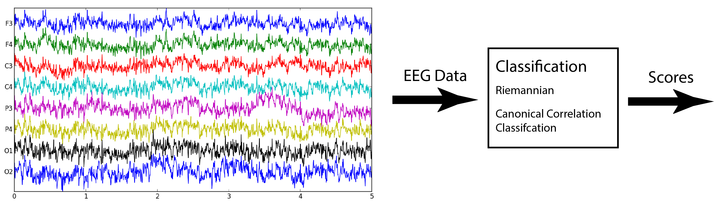

# Classification

Classification tries to find a label for the unlabeled data. In BrainBrowsR's case, we try to find the frequency of the stimulus the user is looking at. There are two main implementations that can be used, [canonical correlation analysis](CCA.md) and methods based on [Riemanian Geometry](riemannian.md). In our current implementation, we used CCA. This requires no training as opposed to Riemannian geometry.

The classifier takes the filtered EEG data from [pre-processing](preprocessing.md) as input and then calculates a score for each of the four stimuli and the highest score should match with the stimulus the user is looking at. In our case, we have added some thresholding to increase the accuracy of our method. This thresholding takes the scores and then calculates the action.
