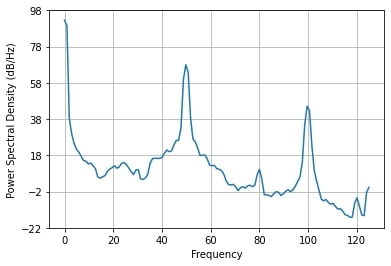
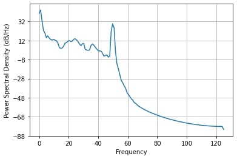
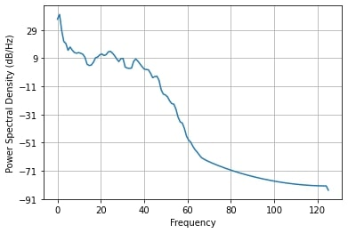

# Preprocessing

Writen by: Rien Sonck

## Goal

The aim of this document is to explain our rationale behind our preprocessing steps.

## Details

Preprocessing of electroencephalogram (EEG) usually consists out of the following steps: 
1) Filtering of the signal (Did we do it: Yes)
2) Downsampling the signal (Did we do it: No)
3) Rereferencing of the signal (Did we do it: No)
4) Interpolation of bad channels (Did we do it: No)
5) Channel selection (Did we do it: Yes)
6) Averaging over trials (Did we do it: No)

In the following, the preprocessing steps considered in this project together with several important decisions are explained in more detail.

### Signal filtering 
Filtering of the signal is a crucial step as Electroencephalogram (EEG) electrodes record much noise. We can distinguish four types of noise: 
1) Environmental noise: this is noise picked up by EEG electrodes from electrical devices around us. These devices work on a powerline of 50 Hz (or 60 Hz).
2) Electrode noise: if an electrode is lose or has a bad conductance between the scalp and the electrode, this can cause a very noise signal. 
3) User noise: noise coming from the users themselves such as muscle movement (eye blinks, jaw clenching, arm movement, ...). 
4) Brain noise: the collected brain signal is a combination of many brain processes going on at the same time. We are often only interested in one or a few brain processes. So, all the irrelevant brain processes to our application can be considered as well to be noise. 

In the BrainBrowsR application, the incoming EEG signal, see Figure 1, is filtered by a notch filter at 50 Hz and a 5th order bandpass butterworth filter between 0.5 and 35 Hz.

*Figure 1: unfiltered incoming EEG signal in the frequency spectrum.*

You might think: why do we still need to use a 50 Hz notch filter if we are already using a 0.5-35 Hz bandpass filter? The reason is that even when using the bandpass filter, the 50 Hz powerline will still leak through the filter due to the roll-off (steepness of the transfer function) not being steep enough, see Figure 2. 

*Figure 2: filtered EEG signal using a 5th order butterworth bandpass filter between 0.5-35 Hz.*

When combining the butterworth filter with the notch filter we get a cleaner signal, see Figure 3. 

*Figure 3: filtered EEG signal iusing a 5th order butterworth bandpass filter between 0.5-35 Hz and a 50 Hz notch filter.*

The range of the bandpass filter was chosen because the target frequencies and one of their harmonics of our BrainBrowsR application are between 6-18 Hz. Furthermore, this bandpass filter also gets rid of strong EEG drifts and offsets that are present in frequencies < 0.5 Hz. 

User noise is more difficult to get rid of. Although muscle noise is most noticeable at the range of 110-140 Hz, it will also contaminate the frequency band that we are interested in: the alpha band.
There are many movement artefact removal methods such as principal component analysis (PCA), independent component analysis (ICA), denoising source seperation (DSS), ... but these methods would take up too much time in our online-system, where we work with 4-second long windows. Thus, the best approach is to tell the user to be as quite as possible when using the BrainBrowsR application.

### Downsampling the signal

Usually EEG signals are downsampled as research-grade EEG headsets have a sampling rate of 1000 - 8000 Hz.
The more samples you have, the longer the processing of the signal will take. Since we only sample at 250 Hz and processes only windows of ~4 seconds of data, there is no need for us to downsample the signal even more.

### Rereferencing of the signal

The EEG signal is not being rereferenced in our application, because rereference to the Cz electrode will reduce the SSVEP signal in the EEG data. 

### Interpolation of bad channels

A high RMS value of a channel means that there is a lot of variability in the channel. These channels contain not much useful information on its own but by interpolationg them with nearby channels, we can still extract their information. We only use three channels so if one or more channels are bad, the data would be useless. Therfore this is not included in the pre-processing.

### Channel selection

Channel/electrode selection, SSVEP is a visually evoked response such that the visual cortex is the most important area for our analysis. This is why we only use occipital placed electrodes: O1, Oz, and O2. The electrode selection is already made on the hardware such that we do not need to include a channel selection in the preprocessing of the signal. 

### Averaging over electrode channels

Averaging over electrode channels is another method that can drastically reduce noise. However, our classification algorithm makes use of the different channels so we do not use any averaging in our preprocessing steps.  

## Implementation

The implementation of the preprocessing is done using the Python programming language.
The brain activity (recorded with the [Mentalab](https://mentalab.com/)
headset) is read into python by using the [explorepy](https://github.com/Mentalab-hub/explorepy) package.

