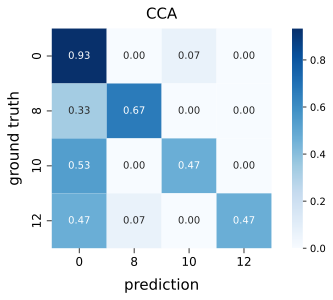
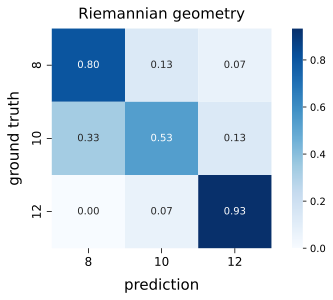

# Results

Written by: Nils Van Rompaey

## Data

### Equipment

We recorded EEG data using the [Mentalab headset](../headset.md) with a sampling rate of 250 Hz. Recording electrodes were placed on O1, Oz, and O2, with the ground and reference electrode on Fz.

The user was seated in front of a laptop with their head about 50 cm away from the screen. We used a laptop with a screen that has a 1920x1080 resolution and a 60 Hz refresh rate.

### Stimuli

The user was shown three stimuli that were overlayed on top of [Instagram](https://www.instagram.com).

Each stimulus is a flickering button with a size of 200x200 pixels that has a distinct color and frequency. INSERT SCREENSHOT

| Button        | Color | Frequency |
| ------------- | ----- | --------- |
| Like/Unlike   | Red   | 8 Hz      |
| Previous post | Blue  | 10 Hz     |
| Next post     | Black | 12 Hz     |

### Recordings

For user comfort and to prevent fatigue, each recording lasted 60 seconds. These recordings were later cut into 4s epochs, resulting in 15 epochs per recording.

## Results

We classified these recordings using the algorithms we implemented and compared the results.

### [CCA](CCA.md)

The confusion matrix below shows the performance of CCA on the recorded data. 0 Hz means the user is looking at the content on the screen, not at any of the stimulations.

In our implementation, an epoch is classified as 0 Hz if none of the correlations are significantly larger than all the others.
More concretely, a correlation is only significant if it is larger than 0.1 and larger than 1.3 times the second largest correlation.

If we consider 0 Hz to be the negative class and the other frequencies as variations of the positive class, we can calculate the following performance metrics:

- False Positive Rate (FPR): 1/15 = 6.67%
- False Negative Rate (FNR): 20/45 = 44.44%
- Accuracy: 38/60 = 63.33%
- Accuracy (only positive predictions taken into account): 24/26 = 92.31%

This means our implementation rarely performs an action when none should be taken (low FPR), and also that the algorithm rarely performs the wrong action (high accuracy when only positive predictions are taken into account). The downside is that it disregards quite a lot of samples (high FNR). However, we believe it is much more important the extension does not perform unwanted actions, rather than trying not to discard potentially useful epochs.

### [Riemannian geometry](riemannian.md)

For Riemannian geometry, there is some difference compared with CCA:

- 0Hz. We do not classify 0Hz since we defined the filter bank to extend signal which can not applied to 0Hz.

We extend the raw signal at first. Then we extract 4-second epochs from the extended data. We have total 45 epochs. Since the dataset is small, in offline pipeline, we use [LeaveOneOut](https://scikit-learn.org/stable/modules/generated/sklearn.model_selection.LeaveOneOut.html) cross validation for training and predicton. The performance is visualized by the confusion matrix. The plot below shows the performance of prediction with accuracy 64%. The 95% confidence interval of the accuracy is (0.505, 0.784).

