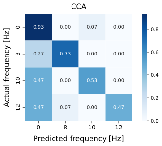
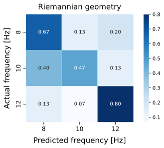

# Results

Written by: Nils Van Rompaey

## Data

### Equipment

We recorded EEG data using the [Mentalab headset](../headset.md) with a sampling rate of 250 Hz. Recording electrodes were placed on O1, Oz, and O2, with the ground and reference electrode on Fz.

The user was seated in front of a laptop with their head about 50 cm away from the screen. We used a laptop with a screen that has a 1920x1080 resolution and a 60 Hz refresh rate.

### [Stimuli](../extension/stimuli.md)

The user was shown three stimuli that were overlayed on top of [Instagram](https://www.instagram.com).

Each stimulus is a flickering button with a size of 200x200 pixels that has a distinct color and frequency.

| Button        | Color | Frequency |
| ------------- | ----- | --------- |
| Like/Unlike   | Red   | 8 Hz      |
| Previous post | Blue  | 10 Hz     |
| Next post     | Black | 12 Hz     |

### Recordings

For user comfort and to prevent fatigue, each recording lasted 60 seconds. These [recordings](sample/sample_data) were later cut into 4s epochs, resulting in 15 epochs per recording.

## Comparison

We classified these recordings using the algorithms we implemented and compared the results.

### [CCA](CCA.md)

The confusion matrix below shows the performance of CCA on the recorded data. 0 Hz means the user is looking at the content on the screen, not at any of the stimulations.

In our implementation, an epoch is classified as 0 Hz if none of the correlations are significantly larger than all the others.
More concretely, a correlation is only significant if it is larger than 0.1 and larger than 1.3 times the second largest correlation. This simple thresholding method can be extended to also include previous epochs in order to acquire a higher degree of certainty. How this is done is explained [here](thresholding.md).

If we consider 0 Hz to be the negative class and the other frequencies as variations of the positive class, we can calculate the following performance metrics:

- False Positive Rate (FPR): 1/15 = 6.67%
- False Negative Rate (FNR): 20/45 = 44.44%
- Accuracy: 38/60 = 63.33%
- Accuracy (only positive predictions taken into account): 24/26 = 92.31%

This means our implementation rarely performs an action when none should be taken (low FPR), and also that the algorithm rarely performs the wrong action (high accuracy when only positive predictions are taken into account). The downside is that it disregards quite a lot of epochs (high FNR). However, we prioritise a high accuracy -such that few unwanted actions are performed- over speed, in which case as few samples as should be discarded.

### [Riemannian geometry](riemannian.md)

In contrast to CCA, we do not classify 0Hz with Riemannian geometry since we defined the filter bank to extend the signal which can not applied to 0Hz.

We extend the raw signal at first. Then we extract 4-second epochs from the extended data. Since the dataset is small we use [LeaveOneOut](https://scikit-learn.org/stable/modules/generated/sklearn.model_selection.LeaveOneOut.html) cross validation in the offline pipeline for training and predicton. The performance is visualized by the confusion matrix. The plot below shows the performance of prediction with accuracy 64%. The 95% confidence interval of the accuracy is (0.505, 0.784).

### Reproducibility

There is an [offline pipeline](sample/offline_pipeline) and [sample data](sample/sample_data) that can be used to reproduce these figures.
