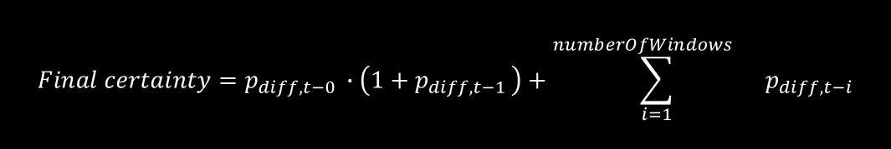

# Thresholding

Written by: Nils Van Rompaey

## Goal

Our CCA algorithm returns a correlation (i.e. a value between 0 and 1) for each of the three frequencies that could be present in the signal. However, we require a way to discriminate between when the user is looking at one of the stimuli rather than just looking at the content of the Instagram post. To this end, we implemented a thresholding function. It assigns a certainty based on the most recent epoch(s) correlations. This function should balance between two things:

+ It should ensure that as many 'positive epochs' (where the user is looking at a stimulus) are classified correctly, which can be achieved by lowering the threshold.
+ It should ensure that as few 'negative epochs' (where the user is looking at content) as possible cause an action to be taken, which can be achieved by raising the threshold.

## [Implementation](../../src/data_processing/thresholding.py)

The thresholding function takes into account the correlations of the current and previous epochs. It calculates a measure of certainty for the current epoch by subtracting the second-largest correlation from the largest correlation. If available, it also takes into account the previous score as 

, where $w$ detones the current window, $n$ is the number of windows, i.e. focus length, and $score_w$ contains the CCA correlations for each frequency prediction. After each epoch, the scores are compared to a threshold vector, which contains thresholds for each frequency. Depending on the user's sensitivity to the different frequencies, the threshold for each frequency must be determined through calibration.

Once the certainty of one of the frequencies surpasses its threshold, the index of the frequency is send to XTENSION. After an action is performed, the thresholding restarts with a certainty matrix containing all zeroes.

An example using three epochs and a uniform threshold of 0.15 is given below. In this example, 10 Hz is selected after three epochs.

| *Correlations* | 8Hz | 10 Hz | 12 Hz |
|-|:-:|:-:|:-:|
| Epoch w-2 | 0.15 | 0.10 | 0.07 |
| Epoch w-1 | 0.08 | 0.18  | 0.04 |
| Epoch w (newest) | 0.07 | 0.15 | 0.09 |

| *Certainty scores* | 8Hz | 10 Hz | 12 Hz |
|-|:-:|:-:|:-:|
| Epoch w-2 | 0.05 | 0 | 0 |
| Epoch w-1 | 0 | 0.10 | 0 |
| Epoch w (newest) | 0 | 0.066 | 0 |
|  |  | |  |
| Final certainty | 0.05 |**0.166** | 0 |
| Threshold | 0.15 |**0.15** | 0.15 |
| Action | / |**Send** | / |

The thresholds and the number of previous epochs can be adjusted to optimise the trade-off mentioned [above](#goal). In doing so, the odds that a random frequency is mistakenly chosen in consecutive epochs and that an unwanted action is performed accordingly are reduced.

## Results

Results of thresholding using only the most recent epoch can be found [here](results.md).
