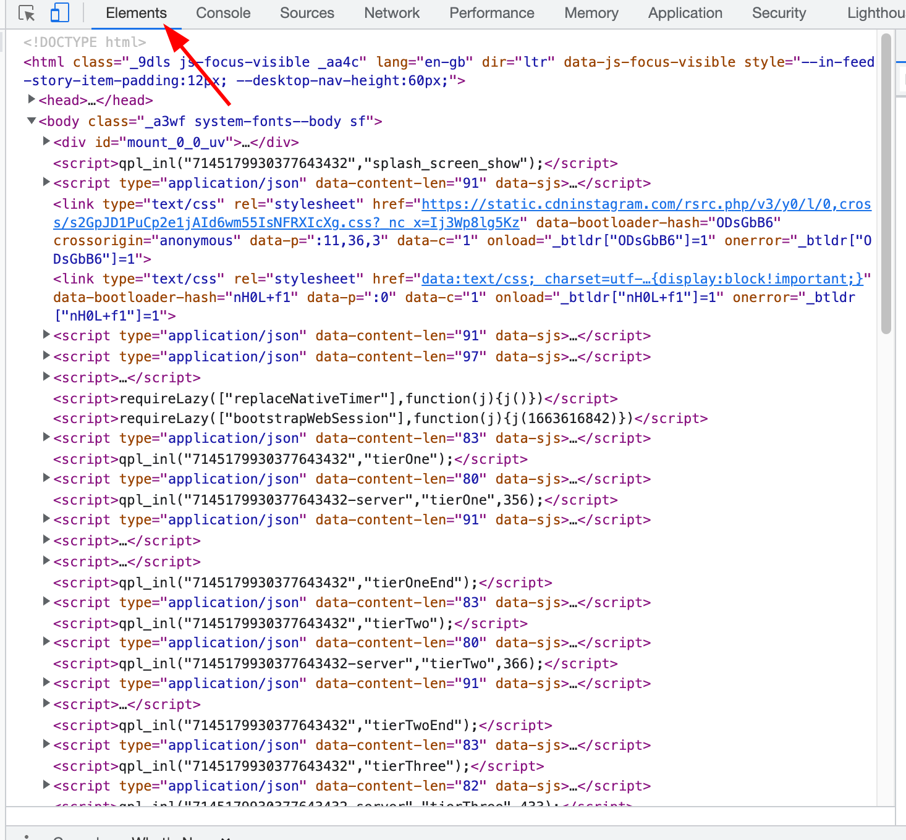
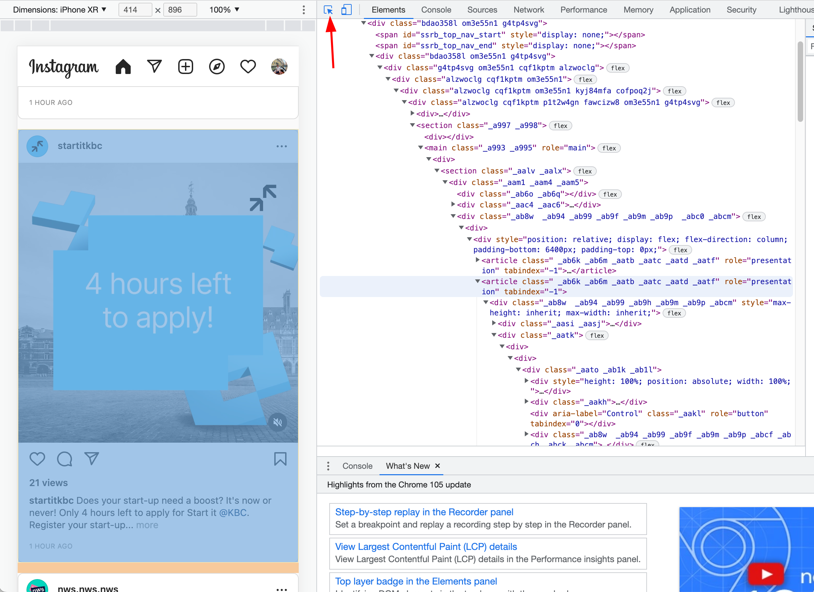

# Parsing

Written by: Samuel Berton

## Goal

With parsing we try to extract certain elements of the html-code that each website is build on. The extracted data is then used by other blocks to create the desired effect of the extension.

## Details

Each website consists of three fundamental technologies:

1. [HTML][1], hyper text markup language
2. [CSS][2] cascading style sheets
3. [Javascript][3]

HTML provides the structure of the document into titles, sections, images, links. To view the html code of any website, you can use 'Inspect Element' in your browser, by right clicking.
Though plain html can already be used for a lot of things, to have nice looking, dynamic websites, it needs to be supplemented with CSS and Javascript. CSS provides the style and javascript makes the websites dynamic. These three technologies play an important part in every website, however as a side-note in modern websites people use technologies like React to actually make website.

Our extension runs in what is called a content script. This is a piece of Javascript code that is inserted in the webpage and can then find and change certain aspects of the website, by using HTML and CSS. In case of parsing, this uses functions as [document.getElementById][4].

## Implementation

The actual implementation of the parser consists of two parts:

1. Finding the posts in the html,
2. Collecting them with a query function.

To find the posts in the html code, it's is recommended to use developer tools in the browser. It depends on which browser is used, but we recommend using either [firefox][6] or [chrome][5]. The panel used here is called the elements panel.  In this panel you find the source html code of the website. For most modern website, such as facebook and instagram, this is very complex and consists of many layers. To make it easier to find the post, there is a handy tool in the right corner of the developer tools. . Hovering with your mouse on certain elements will hightlight them and show them in html. You may need to look at children or parents, but this tool will get you as close as possible.

Next, a query function is used to collect to collect them. For this, we need to know what makes a post unique from other elements. For instagram, either the class or the article tag can be used. The selection function is then either getElementByClassName or getElementByTagName, both function roughly the same as [get element by id][4]. The result of this function is a html-collection. This can be converted to an array or just used as is.

## Results

We can succesfully find all the posts inside instagram. This can be extended to other website, such as reddit, twitter, ... The above methodology is very easy to extend to websites, structured similarly to instagram (a feed).

## Sources

[1]: https://en.wikipedia.org/wiki/HTML "HTML"
[2]: https://en.wikipedia.org/wiki/CSS "CSS"
[3]: https://en.wikipedia.org/wiki/JavaScript "Javascript"
[4]: https://developer.mozilla.org/en-US/docs/Web/API/Document/getElementById "Get element by id"
[5]: https://developer.chrome.com/docs/devtools/ "Chrome devtools"
[6]: https://developer.mozilla.org/en-US/docs/Tools "Mozilla devtools"
