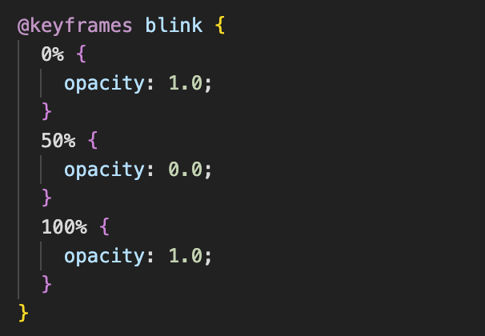

# Stimuli

Written by: Wout Van Droogenbroeck

## Goal

For SSVEP, we need stimuli flickering at different frequencies inserted in the web page. We want the stimuli to be easily adjusted, which means changing the size, color, position, and frequency according to our needs.

## Details

Images on a website are defined as HTML elements, as explained in [the parsing section](./parsing.md). So in order to display the stimuli using the extension, we have to insert them as HTML elements. The flickering effect can easily be added using CSS Animation that changes the element's opacity at a specific rate.

## Implementation

In the [content script](../../src/content_script.js), we create an HTML image element that we append to the body of the web page, using the insertStimuli function in the [stimuli_helper](../../src/helpers/stimuli_helper.js). The element is given a class name that can be used to define its style in the [CSS file](../../src/css/stimuli.css). It is possible to add multiple classes to elements, so they all share one class that defines the flickering animation (the stimuli class below) and the size of the stimuli. However, some variables are changed in their unique class.

```HTML

```

Each stimulus thus also has its class, so their position, color and frequency can be different, as shown here for the like class:

```HTML

```

We also define size, color, and position in the CSS file. All the essential properties can be altered in one place by changing just a few variables for each class. The flickering animation is defined using a simple keyframe that sets the opacity to 1 at the start, 0 at the middle and back to 1 at the end.

```HTML

```

Changing the opacity according to a sine function can also be approximately implemented by defining the animation as below and setting a linear transition:

```HTML

```

To choose a frequency, one can just set the duration of the animation.

## Results

We can successfully insert our stimuli on the web page. The stimuli are easy to change by editing 1 CSS file.

```HTML

```