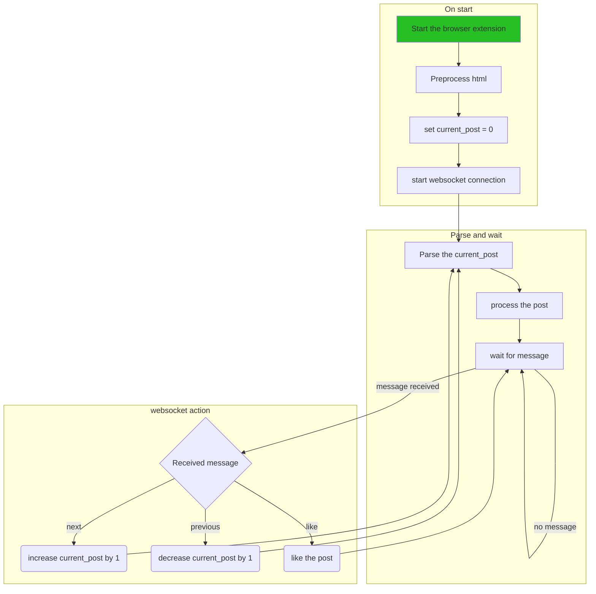

# Software stack

## Goal

The software stack has to connect all the parts together and make sure that the detected SSVEP response has an outside effect.

## Implementation

In the following part a diagram is given to discuss the implementation of the software stack.

