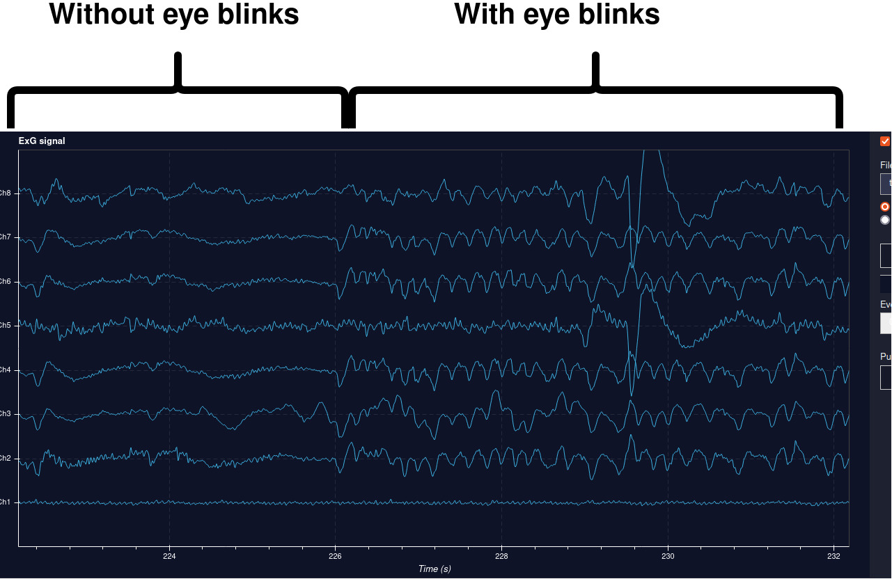

# Headset

Written by: Rien Sonck

## Goal

This document aims to explain the Mentalab Explore headset we have been using and what to pay attention to when using the headset.

## Details

The headset for which our code has been written for the [Mentalab Explore](https://mentalab.com/) headset, a mobile EEG headset working with Bluetooth.

### EEG Pre-Experiment Checklist

Before using the headset for any experiment or application, such as the BrainBrowsR application, make sure to read [Mentalab's EEG pre-experiment checklist](https://wiki.mentalab.com/user-guide/eeg-pre-experiment-checklist/)

### Setting up the headset for the BrainBrowsR application

Before using our application, we must ensure that electrodes are correctly placed, that the correct electrode type is used, and that the EEG signal is checked. We will discuss each of these below.

#### 1) Electrode location

The Metalab Explore headset has eight electrodes that can be placed on its cap. For the BrainBrowsR application, which uses visual stimulation, we need to place the electrodes on the occipital cortex. We recommend placing four electrodes on O1, Oz, O2, and AFz (the reference). See Figure 1.


_Figure 1: Electrode locations for the BrainBrowsR application according to the 10-20 international electrode system_

#### 2) Electrode type

The Mentalab headset comes with two types of dry electrodes. Comb electrodes and flat electrodes see Figure 2. Comb electrodes are ideal for locations that contain hair. Thus if you are using the BrainBrowsR application with someone with hair, install the comb electrodes. If the person is bald, flat electrodes can be used instead.


_Figure 2: Dry electrode types for the Mentalab Explore headset_

#### 3) Checking the signal of the electrodes

Once the cap has been put on the head, ensure that all electrodes touch the scalp for better conductance. When using comb electrodes, you can push on the comb electrode and gently wiggle it to ensure the comb is getting through the hair to the scalp.

Once done, you power on the headset (Mentalab has already written great quick start documentation, which you can find here: [Quick start guide (pdf)](https://wiki.mentalab.com/pdfs/Mentalab_Explore_Quick_Start_Guide.pdf).) and you can run the windows explore application or use the following command in your ipython ([Read how to install ipython here](https://ipython.org/install.html)) to check the incoming EEG signal in your browser:

```python
import explorepy
explorer = explorepy.Explore()
explorer.connect(device_name="Explore_XXXX")  # Put your device Bluetooth name
explorer.visualize(bp_freq=(.5, 30), notch_freq=50)
```

Make sure the signal looks steady (stay still and do not move). See Figure 3.


_Figure 3: Shows the difference between a good and bad EEG signal_

You can then check the responsiveness of the signal by

1. setting the scale of the y-axis scale to 100 UV
2. blinking your eyes repeatedly and rapidly
   Your signal should look similar to Figure 4.


_Figure 4: EEG signal with and without eye blinks_

[Return to mainpage](../README.md)
