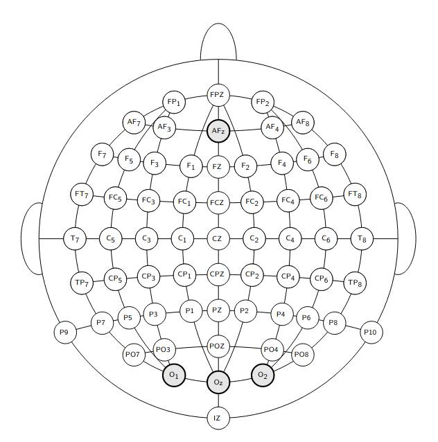
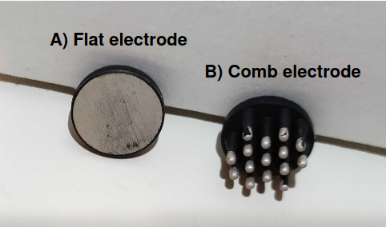
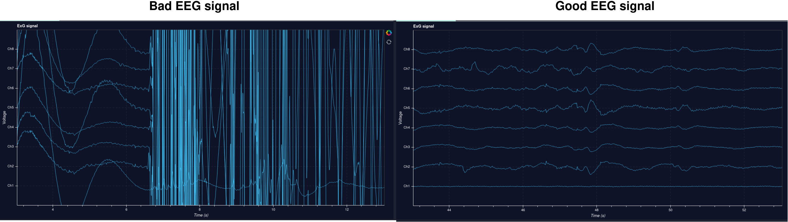

# Headset

Writen by: Rien

## Goal

The aim of this document is to explain the Mentalab Explore headset we have been using and what to pay attention to when using the headset. 

## Details

The headset for which our code has been written for the [Mentalab Explore](https://mentalab.com/) headset, a mobile EEG headset working with Bluetooth. 

### EEG Pre-Experiment Checklist

Before using the headset for any experiment or application such as the BrainBrowsR application make sure to read [Mentalab's EEG pre-experiment checklist ](https://wiki.mentalab.com/user-guide/eeg-pre-experiment-checklist/) 

### Setting up the headset for the BrainBrowsR application

Before using our application, it is important to make sure that electrodes are properly placed, that the correct electrode type is used, and that the EEG signal is checked. We will discuss each of these below. 

#### 1) Electrode location

The Metalab Explore headset has 8 electrodes that you can place on their cap. For the BrainBrowsR application, which uses visual stimulation, we need to place the electrodes on the occipital cortex. We recommend placing three electrodes on O1, Oz, and O2, see Figure 1. 



*Figure 1: Electrode locations for the BrainBrowsR application according to the 10-20 international electrode system*

#### 2) Electrode type

The Mentalab headset comes with two types of dry electrodes. Comb electrodes and flat electrodes, see Figure 2. Comb electrodes are ideal for locations that contain hair, thus if you are using the BrainBrowsR application with someone that has is not bald, install the comb electrodes. If the person is bald, flat electrodes can be used. 



*Figure 2: Dry electrode types for the Mentalab Explore headset*

#### 3) Checking the signal of the electrodes

Once the cap has been put on the head make sure all electrodes are touching the scalp for better conductance. When using comb electrodes, you can push on comb electrode and gently wiggle it to make sure that the comb is getting through the hair to the scalp. 

Once done, you power on the headset (Mentalab has already written a great quick start documentation, which you can find here: [Quick start guide (pdf)](https://wiki.mentalab.com/pdfs/Mentalab_Explore_Quick_Start_Guide.pdf). 
) and you can run the windows explore application or use the following command in your ipython ([Read how to install ipython here](https://ipython.org/install.html)) to check the incoming EEG signal in your browser: 

```
import explorepy
explorer = explorepy.Explore()
explorer.connect(device_name="Explore_XXXX")  # Put your device Bluetooth name
explorer.visualize(bp_freq=(.5, 30), notch_freq=50)
```

Make sure that the signal looks steady (stay still and don't move), see Figure 3. 



*Figure 3: Shows the difference between a good and bad EEG signal*

you can then check the responsiveness of the signal by 
1) setting the scale of the y-axis to 100 mV
2) blinking your eyes repeatedly and rapidly
Your signal should look stimilar to Figure 4. 


*Figure 4: EEG signal with and without eye blinks*

