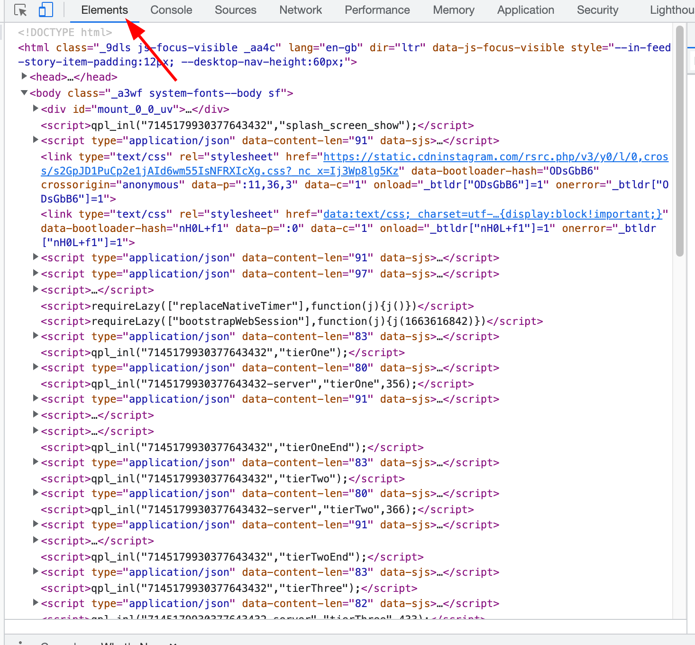

# Parsing

## Goal

With parsing we try to extract certain elements of the html-code that each website is build on. The extracted data is then used by other blocks to create the desired effect of the extension.

## Details

Each website consists of three fundamental technologies:

1. [HTML][1], hyper text markup language
2. [CSS][2] cascading style sheets
3. [Javascript][3]

HTML provides the structure of the document into titles, sections, images, links. To view the html code of any website, you can use 'Inspect Element' in your browser, by right clicking.
Though plain html can already be used for a lot of things, to have nice looking, dynamic websites, it needs to be supplemented with CSS and Javascript. CSS provides the style and javascript makes the websites dynamic. These three technologies play an important part in every website, however as a side-note in modern websites people use technologies like React to actually make website.

Our extension runs in what is called a content script. This is a piece of Javascript code that is inserted in the webpage and can then find and change certain aspects of the website, by using HTML and CSS. In case of parsing we use functions as [document.getElementById][4].

## Implementation

The actual implementation of the parser consists of two parts:

1. Finding the posts in the html,
2. Collecting them with a query function.

To find the posts in the html code, it's is recommended to use developer tools in the browser. It depends on which browser is used, but we recommend using either [firefox][6] or [chrome][5]. The panel we use here is called the elements panel. 

## Sources

[1]: https://en.wikipedia.org/wiki/HTML "HTML"
[2]: https://en.wikipedia.org/wiki/CSS "CSS"
[3]: https://en.wikipedia.org/wiki/JavaScript "Javascript"
[4]: https://developer.mozilla.org/en-US/docs/Web/API/Document/getElementById "Get element by id"
[5]: https://developer.chrome.com/docs/devtools/ "Chrome devtools"
[6]: https://developer.mozilla.org/en-US/docs/Tools "Mozilla devtools"
