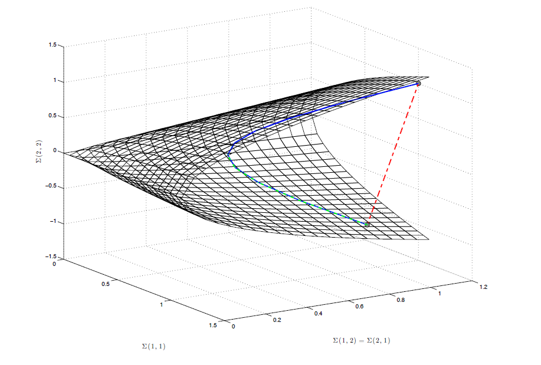
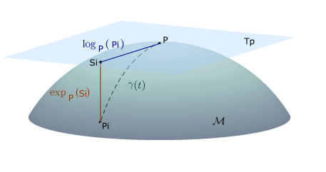

# Riemannian Geometry

Written by: Rochelle Aubry

## Goal

Use Riemannian Geometry for BCI classification.

Riemannian geometry is a branch of differential geometry that studies smooth manifolds. The manifold of symmetric positive-definite (SPD) matrices has proved to be very useful in brain-computer interfaces (BCI), since multivariate electroencephalography (EEG) data in finite time windows can effectively be mapped as points onto this manifold through the estimation of some form of their covariance matrix.

The Riemannian minimum distance to the mean classifier is simple, fully deterministic, robust to noise, computationally efficient and prone to transfer learning. Therefore interesting to be used for BCI applications.

To do this, the paper by [Conjendo et al.](https://hal.archives-ouvertes.fr/hal-02315131/document) was used.

## Methodology

EEG data can be manipulated through their spatial covariances, then detected and classified by measuring the Riemannian distance between covariance matrices of signal epochs and covariance matrices of referenced epochs.

The covariance captures the degree of linear dependence between several random variables, i.e. how the brain signals change relatively to each other. If two signals show the same variations, they are dependent. [read more](https://hal.uvsq.fr/hal-01710089)

Covariance matrices are symmetric positive-definite (SPD) and are thus constrained to lie strictly inside a convex cone, which is the Riemannian manifold.

Figure 1. Riemannian manifold. The Euclidean distance is the red dahed line (which does not consider the curvature of the space) and Riemannian distance is in plain blue and Log-Euclidean in dashed-dotted green (which follows the geodesic , therefore taking into account the shape of the space where covariance matries lie).

Picture taken from [Chevallier, 2018](https://www.researchgate.net/publication/323358565_Riemannian_Classification_for_SSVEP-Based_BCI_Offline_versus_Online_Implementations)

A Riemannian manifold is a differentiable manifold in which tangent space at each point is a finite-dimensional Euclidean space. Euclidean space is a space in any finite number of dimensions, in which points are designated by coordinates (one for each dimension) and the distance between two points is given by a distance formula [Definition](https://www.britannica.com/science/Euclidean-space).

The Euclidian distance does not consider the curvature of the space, while Riemannian distances follows the geodesic and are thus taking into account the shape of the space where covariance matrices lie.

$S_n=\{S\in M_n, S^T=S\}$ represents the space of all $n×n$ symmetric matrices in the space of square matrices.

$P_n=\{P \in S_n, P>0\}$ represents the set of all $n×n$ symmetric positive-definite (SPD) matrices.

The Riemannian distance $\theta_n$ between two SPD matrices $P_1$ and $P_2$ in $P(n)$ is calculated using the following formula:

$$
\theta_R(P_1,P_2)=\Vert\log({P_1}^{-1}P_2)\Vert_F=\left[\sum_{i=1}^n\log^2(\lambda_i)  \right]^{1/2}
$$

The shortest path between two points in the Riemannian space of SPD matrices is defined by the geodesic $\gamma(t)$ with $t\in [0,1]$

$$
\gamma(t)=P_1^{1/2}(P_1^{-1/2}P_2P_1^{-1/2})^tP_1^{1/2}
$$

Figure 2. Tangent space of the manifold M at point P, Si the tangent vector of Pi and \gamma(t) the geodesic between P and Pi. 

Figure taken from [Barachant, 2010](https://hal.archives-ouvertes.fr/hal-00602700/document)

The mean of SPD matrices can be obtained by using the concept of tangent space, which is the space defined by the whole set of tangent vectors, is identified to the Euclidian space of symmetric matrices.

Using the Riemannian Log map, we first project the whole dataset in tangent space, then the arithmetic mean is computed. Finally the arithmetic mean is projected into SPD matrices using Riemannian exponential map. After a few iterations, the geometric mean SPD matrices are obtained.

## Implementation

The general procedure is as follows:

1. **Processing**.
Some processing of the data should be done after the preprocessing steps to accomodate the signal as required. 
Processing consists of two steps that are handled together with the function extend signal. 
First step is a **Filter bank**  
The filter bank is composed of bandpass filters for each stimulation frequency that is applied. This is done using the scipy library, of which the functions [butter](https://docs.scipy.org/doc/scipy/reference/generated/scipy.signal.butter.html) and [filtfilt](https://docs.scipy.org/doc/scipy/reference/generated/scipy.signal.filtfilt.html) were. The `SSVEPFilterBank()` function accepts the EEG signal as a numpy array of shape (number of channels, number of samples) and returns the filtered signal of the form (number of frequencies, number of channels, number of samples))
For the second step we **Stack the filtered signals to build an extended signal**. 
As the filtered signal is a 3-dimensional tensor, it needs to be modified in order to be 2-dimensional (number of frequencies x number of channels, number of samples) in order to compute the covariance matrices. Therefore it will output a signal in a numpy array of shape (number of frequencies* number of channels, number of samples). 

2. **Training**
Further we train our model, for that we will first **Estimate covariance matrices by using Ledoit-Wolf shrinkage estimator on the extended signal**. 
For this, the [pyriemann](https://pyriemann.readthedocs.io/en/latest/generated/pyriemann.estimation.Covariances.html#pyriemann.estimation.Covariances) was used.
This function performs a covariance matrix estimation for each given input, it accepts the epoched extended signal and returns the covariance matrix. 
From this we **Estimate the centroids for MDM classification model**. 
The classification is done by Minimum Distance to the Mean, which works as follows: during training a set of SPD matrices encoding BCI trials for the available classes are created. For each class a center of mass of the available trials is estimated. 

3. **Prediction**. 
The BCI trial is estimated in the same way as in training, and is assigned to the class whose center of mass is the closest. Return predictions for each matrix according to the closest centroid. The detail is in [pyriemann](https://pyriemann.readthedocs.io/en/latest/generated/pyriemann.classification.MDM.html#pyriemann.classification.MDM.fit)

## Results
The prediction result provides the class to which it belongs with a percentage of certainty. 
We can also visualice the result by means of the confusion matrix available by calling the plot_confusion_matrix function.

The evaluation of performance is done by cross validation, K-fold and Leave-One-Out.
