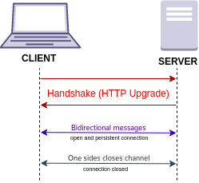
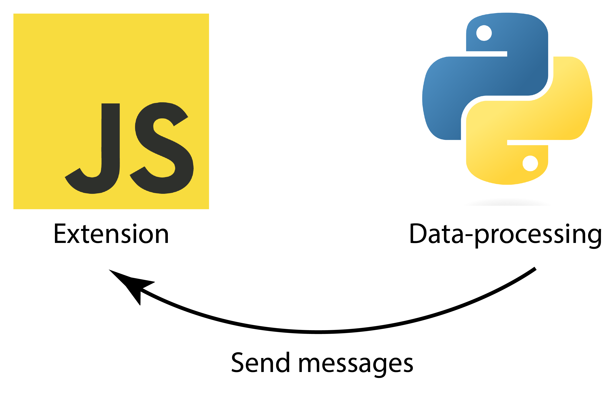
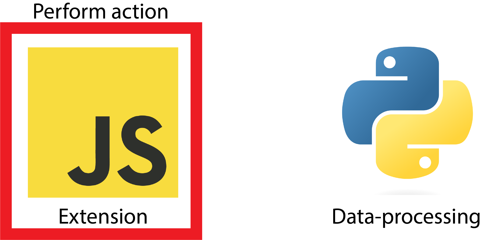

# Websockets

Written by: Samuel Berton

## Goal

Since the data-processing and hardware connection are in Python, there needs to be a way to connect this program with the extension. This is achieved through websockets.

## Details

With websockets, there are two applications, a server and a client. In this case, the extension will serve as the client and the Python code will contain the server. The major difference between websockets and http is that websockets provides a bi-directional persistent connection.

When the client receives a message from the server, it can respond and vice versa, without having to request some information.

## Implementation

In BrainBrowsR, the client code is written in Javascript and the server in Python using [the websockets package](https://websockets.readthedocs.io/en/stable/).

On startup the client initializes a connection. The server, written in Python, sends the label of the SSVEP response that was detected. In Javascript a listener is added that runs a certain function depending on the message.

## Results

There is currently a succesful connection between the extension and Python through websockets. This is however not without issues, to do's. A better way to handle disconnections and also adding the data-processing in the Python code are the next steps in proceeding.
