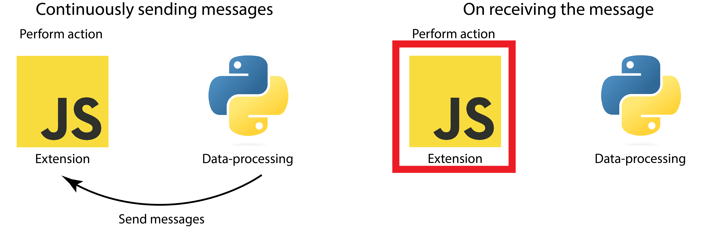

# Websockets

Written by: Samuel Berton

## Goal

Since the data processing and hardware connection are in Python, there must be a way to connect this program with the extension. This connection is achieved through WebSockets.

## Details

With WebSockets, there are two applications, a server and a client. In this case, the extension will serve as the client, and the Python code will contain the server. The significant difference between WebSockets and HTTP is that WebSockets provide a persistent bi-directional connection. Where an HTTP connection closes after it has sent the message, the WebSocket connection stays open until either server or client closes it. This approach makes it very efficient as opposed to polling (i.e. repeatedly checking if the state has changed).

When the client receives a message from the server, it can respond and vice versa without having to request some information.

## Implementation

In BrainBrowsR, the client code is written in Javascript and the server in Python using [the WebSockets package](https://websockets.readthedocs.io/en/stable/). The implementation of this is what we call BrainServR, found in [server.py](../server.py). When an instance of BrainServR is created, it first connects to the headset and then starts up the WebSocket server. When the connection between the extension and server is established, the data processing pipeline sends messages.

On startup, the client (i.e. the extension) initializes a connection. The server, written in Python, sends the label of the detected SSVEP response. In Javascript, a listener that runs a specific function depending on the message is added. The implementation of this can be found in [the content script](../src/content_script.js) under Setup. This function establishes the connection and creates the listener that will respond based on the message sent to the extension.

## Results

There is currently a successful connection between the extension and Python through WebSockets. The connection is opened, and data processing will send the action the extension has to take. This approach is working, and the extension takes the action classification has found.
